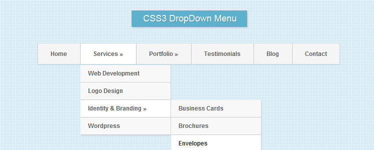

这次我将带来一个实用帖：使用**html5**和**css3**创建自己哒下拉导航条。

原文出处：[Create a Drop-Down Navigation Menu with HTML5 and CSS3](https://deliciousthemes.com/create-a-drop-down-navigation-menu-with-html5-and-css3/)

本文在保持原文的风格基础上，进行了一些补充说明且解决了谷歌浏览器兼容的一个小bug。

好啦，下面开始进入正题。

下拉导航菜单有一些不错的解决方案，例如[**superfish jquery**](https://plugins.jquery.com/superfish/)插件。 多数人使用大量的文件和资源来生成下拉列表，但有时你不需要这么多。 本文将告诉你如何使用HTML5和CSS3来创建自己的简单且时尚的下拉菜单。




[在线demo](http://htmlpreview.github.io/?https://github.com/SunYuqing/demo1/blob/master/index.html)

我们通过构建CSS来控制悬停时下拉框的隐藏和显示，并且使用新的CSS3过渡（transition）功能。 这些效果完全像你以前使用的JavaScript效果。 文档结构简单。 你需要一个index.html和一个类似style.css的样式文件即可。

让我们从HTML结构开始吧。 这是头部：

```
<!doctype html>
<html lang="en>
<head>
	<meta charset="UTF-8">
	<title>使用HTML5 / CSS3 创建的导航菜单</title>
	<meta name="description" content="html5,css3">

	<link rel="stylesheet" href="style.css">

	<!-- IE6-8支持HTML5元素，我们为IE9添加支持html5的js库--> 
	<!--[if lt IE 9]>
	<script src="//html5shim.googlecode.com/svn/trunk/html5.js"></script>
	<![endif]-->

</head>
```

在body部分，我们为`nav`添加html代码。 `li`中的每个`ul`是一个下拉菜单。 我们向每个父`li`添加`»(&raquo;)`以显示层次结构。

```

<body>
<nav id="nav">
	<ul id="navigation">
		<li><a href="#" class="first">Home</a></li>
		<li><a href="#">Services &raquo;</a>
			<ul>
				<li><a href="#">Web Development</a></li>
				<li><a href="#">Logo Design</a></li>
				<li><a href="#">Identity & Branding &raquo;</a>
					<ul>
						<li><a href="#">Business Cards</a></li>
						<li><a href="#">Brochures</a></li>
						<li><a href="#">Envelopes</a></li>
						<li><a href="#">Flyers</a></li>
					</ul>
				</li>
			</ul>
		</li>
		<li><a href="#">Portfolio &raquo;</a>
			<ul>
				<li><a href="#">Graphic Design</a></li>
				<li><a href="#">Photography</a></li>
				<li><a href="#">Architecture</a></li>
				<li><a href="#">Calligraphy</a></li>
				<li><a href="#">Film &raquo;</a>
					<ul>
						<li><a href="#">John Carter</a></li>
						<li><a href="#">The Avengers</a></li>
						<li><a href="#">The Amazing SpiderMan</a></li>
						<li><a href="#">Madagascar 3</a></li>
					</ul>
				</li>
				<li><a href="#">Graffity </a></li>
			</ul>
		</li>
		<li><a href="#">Testimonials</a></li>
		<li><a href="#">Blog</a></li>
		<li><a href="#" class="last">Contact</a></li>
	</ul>
</nav>

</body>
</html>
```

下面我们来为这个导航条添加样式，这些样式你都可以根据自己的情况进行删除修改。

```
/* 主导航 */
*{
	padding:0;
}
#nav {
    position:relative;
    width:620px;
    margin:0 auto;
    margin-top:50px;
    padding:10px;
}
 
ul#navigation {
    margin:0px auto;
    position:relative;
    float:left;
    border-left:1px solid #c4dbe7;
    border-right:1px solid #c4dbe7;
}
 
ul#navigation li {
    display:inline;
    font-size:12px;
    font-weight:bold;
    margin:0;
    padding:0;
    float:left;
    position:relative;
    border-top:1px solid #c4dbe7;
    border-bottom:2px solid #c4dbe7;
}
 
ul#navigation li a {
    padding:10px 25px;
    color:#616161;
    text-shadow:1px 1px 0px #fff;
    text-decoration:none;
    display:inline-block;
    border-right:1px solid #fff;
    border-left:1px solid #C2C2C2;
    border-top:1px solid #fff;
    background: #f5f5f5;
 
    -webkit-transition:color 0.2s linear, background 0.2s linear;
    -moz-transition:color 0.2s linear, background 0.2s linear;
    -o-transition:color 0.2s linear, background 0.2s linear;
    transition:color 0.2s linear, background 0.2s linear;
}
 
ul#navigation li a:hover {
    background:#f8f8f8;
    color:#282828;
}
 
ul#navigation li a.first {
    border-left: 0 none;
}
 
ul#navigation li a.last {
    border-right: 0 none;
}
 
ul#navigation li:hover > a {
    background:#fff;
}
```

注意`ul＃navigation li a`有一些转换(transition)样式。 它们可以创建一个很好的悬停效果。

现在，让我们对下拉菜单进行风格化吧。

```
/*下拉导航*/
ul#navigation li:hover > ul
{
/*这两个样式很重要，显示下拉导航菜单 */
    visibility:visible;
    opacity:1;
}
 
ul#navigation ul, ul#navigation ul li ul {
    list-style: none;
    margin: 0;
    padding: 0;
/*这两个样式也很重要，用于隐藏那些不需要显示的导航菜单*/
    visibility:hidden;
    opacity:0;
    position: absolute;
    z-index: 99999;
    width:180px;
    background:#f8f8f8;
    box-shadow:1px 1px 3px #ccc;
/* css3 transitions */
    -webkit-transition:opacity 0.2s linear, visibility 0.2s linear;
    -moz-transition:opacity 0.2s linear, visibility 0.2s linear;
    -o-transition:opacity 0.2s linear, visibility 0.2s linear;
    transition:opacity 0.2s linear, visibility 0.2s linear;
}
 
ul#navigation ul {
    top: 43px;
    left: 1px;
}
 
ul#navigation ul li ul {
    top: 0;
    left: 181px; /* 和上面的 width:180px 有关联*/
}
 
ul#navigation ul li {
    clear:both;
    width:100%;
    border:0 none;
    border-bottom:1px solid #c9c9c9;
}
 
ul#navigation ul li a {
    background:none;
    padding:7px 15px;
    color:#616161;
    text-shadow:1px 1px 0px #fff;
    text-decoration:none;
    display:inline-block;
    border:0 none;
    float:left;
    clear:both;
    width:150px;
}
```

现在我们就创建了风格化的下拉导航菜单。当然有菜单的IE兼容性问题。 使用CSS3过渡实现的平滑效果无法在IE下工作，但菜单仍然是一个可靠的替代javascript的菜单。
